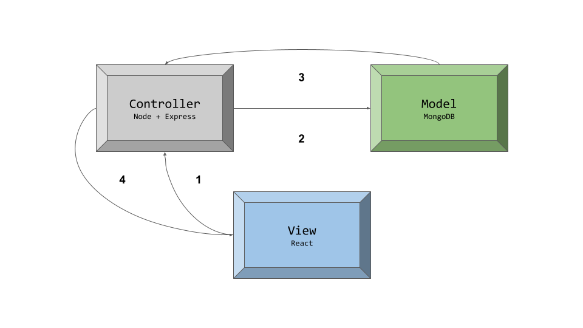

# TEAM 05

Our mockup can be found [here](https://www.figma.com/proto/iEmV1F92QeE08YhtmHmbLp/RefuTalent-Mockup?node-id=0%3A3&scaling=scale-down). Please see Q4 for details regarding the mockup.

#### Q1: What are you planning to build?

The main goal of the RefuTalent web application is to provide a service that helps refugees integrate into their communities, while giving marginalized groups the opportunity to receive professional services through volunteer work. Specifically, this web application will help RefuTalent `Volunteer` users match `Host` users who are seeking services, such as tutoring services, with refugee volunteers. For clarification, a RefuTalent `Volunteer` user is someone who has been recruited by RefuHope to act as a liaison between refugees and `Host` users.

A typical matching process is as follows: A RefuTalent `Volunteer` user, who will represent a number of refugee volunteers, will use the RefuTalent platform and create profiles for the refugee volunteers. A `Host` user will use the RefuTalent platform to post new volunteering opportunities. The RefuTalent `Volunteer` user will then review and MATCH the opportunity with a refugee volunteer profile, or REJECT the opportunity post. Not only will this provide refugees with more opportunities to build their volunteer experiences in Canada, but it will also help ease the transition of moving to a new country by getting involved in their local communities. 

---

#### Q2: Who are your target users? 

Our application supports two distinct types of users; `Host` users, and RefuTalent `Volunteer` users. The `Host` users are individuals looking for someone with expertise to provide them specific services, such as TUTORING or GROCERY SHOPPING. The RefuTalent `Volunteer` users are members of the RefuHope team who will act as a liaison between a set of refugees and `Host` users. Essentially, the RefuTalent `Volunteer` users will be responsible for matching refugees to opportunities based on criteria such as availability, relevance, and skill. Note that these RefuTalent `Volunteer` users meet and interview each of the refugees that they represent; they have an intimate understanding of the needs and wants of each such refugee. 

**Persona: Host A**

    Name: Megan
    Age: 28
    Frustrations:
        - Taking college courses to start a new career, needs help with her classes
        - Tight on money due to student debt, unable to pay for tutor services
        - Wants to do well in her classes in order to earn academic scholarships
    Goals:
        - Find a volunteer to tutor her
        - Save money on hiring a tutor
    Technical abilities:
        - Has access to a phone, laptop; uses both these devices every day

**Persona: Host B**

    Name: Arthur
    Age: 67
    Frustrations:
        - Needs help with buying groceries
        - Finds it difficult to go out to the local grocery store due to the distance
    Goals:
        - Find a volunteer to help buy him groceries
    Technical abilities:
        - Has access to a laptop; does not use it very much

**Persona: RefuTalent Volunteer**

    Name: Taylor
    Age: 25
    Frustrations:
        - Needs to keep track of many volunteers and their skills
        - Difficult to keep track of all volunteer positions
    Goals:
        - Would like to easily match the needs of hosts
        - Manage the information of volunteers easily
    Technical abilities:
        - Has access to a laptop; uses it often

Traditionally, personas are defined as `"distilled essences of real users."` Even though our application only has two types of users, namely RefuTalent `Volunteers` and `Hosts`, we felt that it was important to also think of the individuals that are indirectly involved. Ultimately, the goal of this project is to improve the lives of refugees, and make it easier for them to find relevant experiences.  As a result, we decided to create personas for individuals that we think might indirectly benefit from this project.

**Persona: Refugee A**

    Name: Rebecca
    Age: 31
    Frustrations:
        Difficult finding a job after coming to Canada recently
        Needs volunteer experience in Canada to help with finding a job
    Goals:
        - Wants to eventually find a job to support her two kids
        - Would like a connection to someone who has their life rooted 
          in Canada to help her integrate into the Canadian community
    Technical abilities:
        - Has access to a phone; uses it daily

**Persona: Refugee B**

    Name: Taylor
    Age: 42
    Frustrations:
        - Hard to find Math students after moving to Canada since they have not taught 
          anyone in their community yet
        - Needs to make money to pay rent in their new apartment
    Goals:
        - Find some Math students to gain exposure in their community
        - Would like to build a life in Canada
    Technical abilities:
        - Has access to a phone and tablet; uses both devices regularly

---

#### Q3: Why would your users choose your product? What are they using today to solve their problem/need?

RefuTalent would uniquely satisfy the Host and RefuTalent Volunteer users’ needs. Host users will have their requests for services satisfied through the help of RefuTalent Volunteer users, which saves Host users money while still allowing them access to quality service. RefuTalent Volunteer users are able to connect refugees with volunteer experiences in Canada and familiarize themselves with their communities. Additionally, RefuTalent is unique because, while there are other organizations that help refugees find volunteering opportunities, RefuTalent is the only one that aims to have an accessible and moderated matching process between Hosts and refugee volunteers through the help of RefuTalent Volunteer users.

This project is a great extension of RefuHope’s mission, which is to ensure the needs of newcomers, especially refugees, are met. They aim to help these people integrate within their communities and maintain a healthy social life. With the RefuTalent project in particular, RefuHope is also able to bring quality help to the underprivileged.

---

#### Q4: How will you build it?

We will be using the MERN stack (React, Express, MongoDB, and Node.js). We will also use Travis for our CI service, and Jest for testing. For deployment, we will use Firebase.
 
For the application’s architecture, we decided to use the Model View Controller (MVC) design pattern. MVC is  the most common architectural pattern used for web applications since each of its high level components, namely Model, View, and Controller, have a natural mapping to the typical frontend, backend, and database components of most modern websites. At a high level, the interactions between the end users and our application can be described by the following diagram



1. **View → Controller**

    A user interacts with the UI. The view component (client-side React code) processes the user’s input and triggers an appropriate event, passing the data to the correct endpoint of the controller. 

2. **Controller → Model**

    The controller (server-side Node + Express API endpoints) receives, validates, and interprets the data. Depending on the type of event that was triggered, the controller sends a signal to the model to modify the corresponding dataset.

3. **Model → Controller**

    The model (MongoDB) updates the dataset specified by the controller, and returns an updated view of the data.

4. **Controller → View**

    After receiving the updated data from the model, the controller further processes this to a format usable by the view component. Then, the newly updated and formatted data is sent back to the view. Finally, the view presents the updated data back to the user.

For our objects and schema, we will use UML diagrams to express and organize the corresponding functionalities and attributes. For third party applications / APIs, we will be using MaterialUI for our React components. Our testing strategy will be automated, and we will use the Test-Driven Development (TDD) process as we work.

**Mockup**

Our mockup can be found [here](https://www.figma.com/proto/iEmV1F92QeE08YhtmHmbLp/RefuTalent-Mockup?node-id=0%3A3&scaling=scale-down). Note that this mockup was created following the MVP requirements specified in the project proposal document, as provided by the RefuHope team. When we showed this mockup to our project partner, however, they clarified that the project proposal document didn't entirely and accurately express their current needs. Fortunately, our project partners acted quickly, and finalized a new specification for the MVP. 

In short, this mockup represents the set of functionalities that were initially specified, and is missing some of the requirements outlined by the new specification (that we received on Saturday, Feb 13).

---

#### Q5: What are the user stories that make up the MVP? 

1. As a `Host` user, I want to find a volunteer so that I can get the quality help I need without having to worry about money.

    *Acceptance criteria:* Given the following: (1) I have made a post stating the type of help I seek, (2) a number of potential Refugee volunteer candidates who have the expertise in my area of need and have replied to my post, and (3) I have selected the desired candidate, I expect to have the selected candidate fulfill my request.

2. As a RefuTalent `Volunteer` user, I want to find a way to easily showcase Refugee Volunteers’ expertise so that I can connect them to the community and help them gain volunteer experience.

    *Acceptance criteria:* Given the following: (1) I can easily add a Refugee volunteer profile for a volunteer opportunity (2) I can match suitable Refugee volunteer(s) with a Host user’s opportunity post, I expect to communicate the progress and status of a Host user’s opportunity post.

3. As a RefuTalent `Volunteer` or `Host` user, I want to be able to use the RefuTalent application seamlessly to make it easy for me to match a volunteer opportunity post with a Refugee volunteer.

    *Acceptance criteria:* As a RefuTalent Volunteer user, given access to the application, I expect that there is a process to match refugee volunteer profiles with existing volunteer opportunity posts so that I can make a suitable matching. As a Host user, given access to the RefuTalent application, I expect to be able to create volunteer opportunity posts easily and have a clear view of which Refugee user has been matched to my posts so that I can receive the help I need.

4. As a `User Admin`, I want to be able to modify info of existing users, give and remove admin privileges, as well as delete users so that I can manage customers of the application

    *Acceptance criteria:* Given a user admin page that is only available to a user admin, I expect to be able to modify user information and privileges as well as delete users.

5. As a `Moderator`, I want to be able to edit and delete posts made by users so that I can moderate the content on the web application for the safety of the customers.

    *Acceptance criteria:* Given a post created by a user, I expect to see an edit and delete button available only for me and not regular users.

---

#### Q6: What are the roles & responsibilities on the team?

Firstly, we have the Frontend, Backend and Testing roles which will be focused on Frontend, Backend and Testing respectively. Next, the Team Relations role will be focused on keeping track of team members in terms of communication and work done. It will also involve some managerial work such as coordinating meetings and dealing with any problems that arise in the team. Finally, the Partner Relations role will involve keeping our Partner updated and relaying information back and forth from the Partner to the Team. This will also involve attending bi-weekly meetings with the Partner. 

The responsibilities and strengths and weaknesses of our team is laid out below.

1. *Adi* will be responsible for Frontend development, Partner Relations and Testing.
```
- Strengths: React, JS and Design Patterns
- Weaknesses: Agile Software Development, CSS and DevOps
```

2. *Grace* will be responsible for Tech Research, Partner Relations and Backend development.
```
    - Strengths: Backend, CI/CD and Git
    - Weaknesses: Test-driven development, React and Firebase
```

3. *Luke* will be responsible for Frontend development and Team Relations.
```
    - Strengths:  React, Git and the Fetch API
    - Weaknesses: Testing, CI/CD and Firebase
```

4. *Yi Lei* will be responsible for Backend development and Team Relations.
```
    - Strengths: Python, JavaScript and Vue
    - Weaknesses: CSS, CI/CD and Firebase
```

5. *Joanna* will be responsible for Frontend and Backend development.
```
    - Strengths: UX, Javascript and React
    - Weaknesses: Automated Testing, Git and CI/CD
```

---

#### Q7: What operational events will you have as a team? 

Our team plans to have recurring meetings either weekly or biweekly. These meetings will take place online and the time slots will depend on the availability of all members during the week. The purpose of meetings will vary depending on the stage of product development. For instance, we are currently still in the early planning stages, but down the line, the focus of meetings may shift more towards code reviews. In addition, our team will use internal meetings to prepare for partner meetings, which can include discussion around who will attend meetings, questions to ask, proof of concept demos, and design proposals.  

In the initial partner meeting on Feb 5th, we discussed the overall scope of work for the project including the main functionality of the web application as well as the overall goals of the organization. The RefuTalent team informed us that the main goal of the project is to help integrate refugees in their communities with the key functionality being that host users are able to easily view refugee applications and communicate with refugee users for volunteer opportunities. We also came into the first meeting with a list of initial questions that were relevant to Deliverable 1 work and beyond, including questions on the tech stack, target users, sensitive user information and future communication methods. The outcome of this meeting resolved all these inquiries and provided our team with a clear set of expectations surrounding this project moving forward. Lastly, we agreed to schedule a second meeting a week later that will be centered around feedback on mockups and outstanding questions regarding Deliverable 1.    

For the second partner meeting on Feb 12th, more members of the RefuTalent team participated and provided input for additional features that may or may not be implemented as part of the scope of this project. These included pitching the idea of a Google Forms feature to expand user opportunities and a screening process to ensure users who sign up using the application meet certain requirements. Given that these are advanced features that will alter the planning process and were not brought up in the first meeting, the RefuTalent team agreed to have a discussion amongst themselves and provide us with a clearer set of implementation features once they come to an agreement. Furthermore, this meeting helped our team obtain feedback on some of the Deliverable 1 mockups and questions, which turned out to be mostly positive. The last item of discussion was bringing up the Intellectual Property Confidentiality Agreement to our partner, and they agreed to share the codebase publicly but any additions RefuTalent makes after the course will be private.     

In total, we had around 60 minutes of meeting time with our partner. Moving forward, we have tentatively agreed on a biweekly regular meeting schedule with the RefuTalent team on Friday evenings.  

---

#### Q8: What artifacts will you use to self-organize? 

To keep our team organized and on schedule, our goal is to maintain a flexible method of task management with the help of a ticketing system. We considered options such as Github Issues and Zenhub for this, but ultimately decided on going with the Trello platform. Additionally, our team will make use of shared documents to keep track of any written tasks such as planning documents. Task prioritization depends on deadlines and partner meetings; for instance, completing the mockups was a top priority for the 2nd partner meeting to obtain feedback on the initial product design. 

Thus far, tasks have been assigned based on team members’ skills and experiences. For example, we have two team members who have previous experience working with Figma, so naturally they took on the responsibility for creating the mockups for Deliverable 1. For other tasks such as completing the planning.md document, we divided the work equally (e.g. number of questions completed), based on team members' preferences and on a first-come, first-serve basis. Moving forward, we will keep a similar approach when dividing tasks, while also making use of a ticketing system. The status of a task will be deemed to be complete once it has met all project expectations, integrated any constructive feedback, and the work has been reviewed by at least one other team member. 

---

#### Q9: What are the rules regarding how your team works? 

**Communications**

The expected frequency for communication within our team is to keep each other updated on a weekly basis. This includes updates on responsibilities, as well as completed tasks. We will be using a group chat for standard communication and Discord for meetings. In regards to partner communication, the expected frequency will be once every two weeks for meetings, which will be held using Google Meet (the platform of our partner's choice). For other communication, such as minor questions or clarifications outside of scheduled meeting times, we will use email. 

**Meetings**

Our team expects all members to hold themselves accountable for attending team meetings, getting their own work done, and taking initiative when needed. If someone is particularly busy during a specific week, our team will try to accommodate for that by dividing work or shifting deadlines as needed. In the scenario that someone fails to communicate with the team or fails to complete their tasks, this will be addressed according to the following conflict resolution section. There are no moderators during meetings; each team member individually asks questions and makes a note of the corresponding replies. Lastly, our team plans to have two members be the main point of communication with the RefuTalent team.    

**Conflict Resolution**

One scenario that we discussed was a situation where a team member is busy or unresponsive, with a deadline in the near future. We decided that in such situations, if an individual is not communicating with the rest of the team for 1-2 days, the first approach should be to try alternative methods of communication, such as email or direct messages on a different platform. If there is still no response after 2 days, we will contact the teaching team to report the situation and redelegate the remaining work. A student dropping the course near a deadline also would warrant a similar approach. 

Similarly, there may be a scenario where a deadline was not met because a team member did not complete their share of the work. In this case, we agreed that a reasonable course of action would be to contact and apologize to the teaching team and the partner, and discuss options to extend the due date to accommodate for the missed work. 

A very common situation that arises in team environments is indecision, when two or more members share conflicting opinions. Since our team currently consists of 5 members, we agreed that the easiest way to resolve this would be through a majority vote.  

Another potential conflict could arise due to poor workflow. This may include undescriptive commits and pull requests with too much code changed at once. To address this, our team decided on a set of workflow rules. First, all development work will be done using branches, and pull requests will be used on Github to merge any work from a branch. There must be a minimum of 1 other person who closely reviews the code before squashing and merging the branch into the dev or main branch. 

The final issue our team discussed was a work delegation imbalance. This will be resolved by ensuring that we stick with a ticket-based system to assign and ensure everyone has a balanced amount of work. If a teammate has a particularly difficult task that is overly time-consuming, we will encourage them to communicate with the rest of the group and any other teammates who are free can assist them in completing that task. 

---

#### Highlights

**Tech Decisions**

During the planning stage, we found that our team’s preference for the tech stack was fairly consistent. However, there was a key choice of technology that caused indecision amongst the group members. 

This choice concerned which version, or flavour, of React we should use for the project. Most of us are familiar with the traditional class-based components; declaring and defining custom components which inherit from the React.Component superclass. Despite having experience with such components, working with classes and the ‘this’ keyword in JavaScript is always tricky, and can lead to confusing bugs. Additionally, factoring out logic and re-using code isn’t as easy with class-based components. On the other hand, functional components, with the aid of React-Hooks, by-pass using classes and the ‘this’ keyword, and make factoring out logic and common functionality super easy. Despite the obvious benefits, our team wasn’t immediately sold on using React-Hooks and functional components due to our collective lack of experience. 

Ultimately, we decided that we wanted to create a solution for our partner that not only uses the latest technology, but also makes the codebase easier to maintain and extend. The biggest factor that contributed to this decision was that our MVP will act as a foundation for our partner to build upon, and we wanted to ensure that it is as flexible and extensible as possible. Because of this, we decided to use React-Hooks and functional components, despite our lack of experience with them.

**Delegating Responsibilities**

Our group consists of curious and innovative students who like to seize every learning opportunity. As a result, we struggled with trying to assign roles and responsibilities to each member; everybody wanted to learn and gain experiences from ALL aspects of the project. We all wanted to partake and contribute to each of the various roles, such as front-end, back-end, DevOps, etc. 

While allowing each group member to explore and contribute to all of the responsibilities of interest would be more fun, we quickly came to the realization that this could create a messy codebase that is hard to test, maintain, and extend. Heeding the advice of “too many cooks spoil the broth,” we came to a compromise that both creates a semi-strict structure of responsibilities, as well as allows the possibility of exploring areas of interests outside of the assigned roles.

In this model, each of the five group members has a few main responsibilities, which were assigned on the basis of experience and preference. However, as need arises in a particular area of the project, the group members who are interested can undertake additional responsibility, and help out in that section of the project. For example, Grace has taken on three main responsibilities;  tech researcher, partner relations, and backend. However, if the front-end team is struggling to meet deadlines, Grace has the possibility of exploring the front-end domain of the project by lending a helping hand. 

Note that there may be a case where help is needed in a particular area of the project, but none of the other group members, members whose main responsibilities lie elsewhere, are interested in it. In such a case, we will have to come to a compromise, and assign a member to help out the struggling team, regardless of interest. 

**Workflow Choices**

During the planning phase, our group decided to come with a set of rules that will help maintain an organized and traceable codebase. We came up with some general rules, which are listed below. Note that this standard for workflow etiquette has been briefly discussed before, however, we wanted to include it here because we believe that it is an extremely important decision, and will govern how organized and maintainable our repository is.

Guideline:

- All new work must be done on a local branch.
- Commits should be done frequently, and should have accompanying messages with - clear descriptions of the changes made.
- Once a feature has been implemented, its corresponding branch should be pushed upstream, and assigned a pull request with at least 1 reviewer.
- The development branch MUST be kept clean; feature branches must pass all tests before being squashed and merged into the development branch

We believe that adhering to the aforementioned guideline will help us create and maintain an organized repository, and make it effortless to track and identify the commits that introduced certain issues. 

While all group members agreed on having some standard etiquette for creating, committing, and pushing features, there was some indecision regarding the steps required to merge feature branches into the dev branch. Some members wanted to merge without squashing, in order to have a complete history of commits in the dev branch, which could help pinpoint the exact commit that introduced a bug. However, as one of the group members mentioned, the same accessibility to commits could be achieved even with squashing and merging. The proposed solution was that we would keep the commit history for the development branch as clean and minimal as possible. Then, in the case that we needed to track and view the commit history with a finer granularity, we could look at the pull requests corresponding to the feature in question, and identify the exact commit that introduced the bug.

---

#### Intellectual Property Confidentiality Agreement

Our team came to the following agreement with our project partner (RefuHope):

The code that we (the student engineering team) implement will be publicly available, and we can share it with whoever we want. However, once the partner (RefuHope) forks the codebase into a private repository after the final product hand-off, any extensions and modifications they make are solely theirs.
