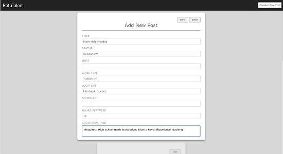
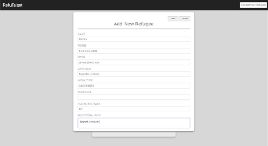

# TEAM 05

## Description 

Our application is a service that allows Canadian refugees to get involved with their community through various volunteering opportunities. Often refugees feel isolated and have trouble when they move to a new country. Our application aims to combat this by allowing refugees to connect with members of their communities that are in need of volunteering help (for example, grocery shopping for elder community members). This can allow them to help out in their community, make friends, and create connections and references that might help them in their future endeavors as new Canadians.

## Key Features

The key features of our application are the volunteer and host boards, which display refugee and volunteering opportunities respectively. We have also implemented basic sign-up and log-in functionalities.

The volunteer board displays previously created refugee profiles, and allows for the creation of new refugee profiles, which are displayed on the board after the creation process has been successfully completed. The refugee profiles contain various data, including name, contact information, availability and location. 

On the other hand, the host board displays the volunteering opportunities that have been created by the `Host` users. This board, like the refugee board, also allows for the creation of new posts regarding volunteering opportunities. These posts include the title, the id of the Host user that created this post, the type of work, location, schedule, and hours, as well as any other additional relevant information. It also displays the status of a job, which indicates whether a particular opportunity is still open, or it has been matched to a suitable refugee volunteer. If there is a match, it is given the matched status. 

Finally, our user authentication allows `Host` users to sign up in order to view and use our application. Note that there is no way to create `Volunteer` (RefuTalent Staff Member) users as these users should only be created by the RefuHope team. The design considerations for creating these users are to be discussed as a part of the next deliverable. 

## Instructions

Development environment: https://refutalent-dev.herokuapp.com

Production environment: https://refutalent.herokuapp.com

**User creation and authentication**

In both environments, there are two pre-created users that a tester can login as:
- a `Host` user: `host@test.com / hostpassword`
- a `Volunteer` user: `volunteer@test.com / volunteerpassword`

Upon navigating to the home page of our application, the user is prompted with a Login page. The user can either enter the credentials provided above or create a new `Host` user.

*NOTE: Please do not enter real email addresses or passwords. At the moment, our database and backend are not secured. This functionality will be implemented as a part of the next deliverable.*

**Host Dashboard**

When logging in as a `Host` user, the user will be navigated to the Host Dashboard. There is a list of opportunities that are already created, as well as a button to create a new opportunity post. When creating a new opportunity, a form pops up and users must fill it out with all relevant information. Note that:

- the “Location” field must be comma separated, with the format `City, Province` (e.g. `Toronto, Ontario`)
- the “Status” field is stored as one of `IN REVIEW`, `MATCHED` or `REJECTED` in the backend. It is not meant to be a part of the final form for creating a new post, but was added for debugging and demonstration purposes. This field can be safely ignored.
- the “Work Type” field must be one of `GROCERIES` or `TUTORING`
- the “Host” and “Schedule” fields can be left blank, as the implementation for these fields were not planned for this iteration.

Below is an example of a valid form:

Upon clicking “Save”, the opportunity post should be added to the Host Dashboard. The user can also edit an opportunity post using the UI, but these changes will not be reflected in the backend as the implementation was not planned for this deliverable.

**Volunteer Dashboard**

When logging in as a `Volunteer (RefuTalent Staff Member)` user, the user will be navigated to the Volunteer Dashboard, which displays all the previously created refugee profiles. The user can create a new refugee profile by clicking the button in the top right and filling out the form with the relevant information. Note that:

- the “Location” field must be comma separated, with the format `City, Province` (e.g, `Toronto, Ontario`)
- the “Work Type” field must be one of `GROCERIES` or `TUTORING`
- the “Schedule” field can be left blank, as the implementation for these fields were not planned for this iteration

Here is an example of a valid form:

Upon clicking “Save”, the refugee profile should be added to the Volunteer Dashboard. The user can also edit a profile using the UI, but these changes will not be reflected in the backend as the implementation was not planned for this deliverable.

## Development requirements

Prerequisites
- NodeJS v 12.x
- NPM v 6.x
- MongoDB Community Edition v 4.4

Local setup instructions
1. Clone the repository.
2. Using your terminal, `cd` into the `deliverable-2` directory. This is where the project lives.
3. Run `npm install` in both the `backend` and `frontend` directories.
4. Next, you need to set up a local Mongo database:
    - Create a directory (anywhere) called `database`. This is where your local Mongo database will be located.
    - Run `mongod --dbpath <path to the database directory you just created>`
5. To run the backend locally:
    - `cd` into the `backend` directory
    - Run the command `npm start`. This will start an Express API server at `http://localhost:5000`
6. To run the frontend locally:
    - `cd` into the `frontend` directory
    - Run the command `npm start`. This will start a server running the React frontend app at `http://localhost:3000`
7. To test the development environment, navigate to https://refutalent-dev.herokuapp.com. This is also the host for API routes.
8. To test the production environment, navigate to https://refutalent.herokuapp.com. This is also the host for API routes. 

 
## Deployment and Github Workflow

**Local Work**

Our team uses a ticket-based system where each developer is assigned a task from a shared Trello board. Each task has a number which uniquely identifies said task. The developer should do all of their work on a branch off of the `develop` branch and name it using the unique task number, e.g. `task9-setup-routes`. This makes sure that the branches have unique names when being pushed to remote. In the commit message of the PR, the developer should include a brief description of the work done to maintain a descriptive Git history.

**Code Review**

Once the developer is done their work, they will create a pull-request for peer review, and assign the reviewer depending on the task. For example, any tasks related to backend work should be assigned to developers on the backend team. After addressing any change requests, a reviewer will merge the code. We decided to use the “Squash and merge” option since this will combine all commits to a PR into one commit and keep the Git history of the `develop` and `main` branches clean. In addition, the commit message in the `develop` branch will contain the PR number after the “Squash and merge” is completed. This way, in the case that a developer wishes to see a commit’s original PR, they can easily find it.

**Deployment**

For this project, we used Travis CI for CI/CD. Once a commit is merged into `develop`, the deployment pipeline is automatically triggered by Travis, which will run linting and unit tests, and finally deploy the latest code to the development environment on success.

After every few commits to the `develop` branch, a developer will manually update the `main` branch with the latest `develop` code. This should only be done after verification that the `develop` branch is behaving as expected. We decided to make this a manual step in the deployment process to production because this prevents any unwanted behaviours in the production version of the application.

## Licenses 

The code that we (the student engineering team) implement will be publicly available, and we can share it with whoever we want. However, once the partner (RefuHope) forks the codebase into a private repository after the final product hand-off, any extensions and modifications they make are solely theirs. This has no effect on our development and we reached this agreement because we felt that it was the most fair for both sides.