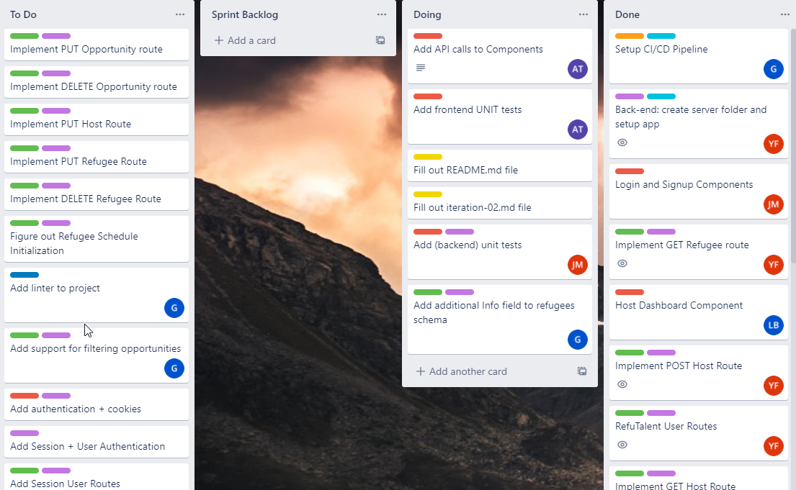

# TEAM 05

## Iteration 02 - Review & Retrospect

 * When: 03/15/21
 * Where: ONLINE

## Process - Reflection

#### Q1. Decisions that turned out well

1. **Using Trello as a task management board**

    Our team made an early decision as part of the deliverable 1 planning phase to use Trello as a platform for managing and tracking tasks. This has been one of our most successful team choices thus far, as having a task board allowed us to organize sprint backlogs, mark tasks as in progress or complete, and efficiently allocate tasks to team members as part of a ticketing system. An overview of this artifact can be seen below: 

    

2. **General Workflow**

    The workflow choice our team made during planning was to follow a set of rules to maintain a clean, traceable codebase. The process is summarized as follows: 

    - Team member assigns themselves to an item in the sprint backlog and moves the task under “doing” 
    - New work is done on a local branch named with the convention `task#-name`
    - A pull request is made for the branch pushed upstream with concise commit messages that passes all Travis CI tests 
    - After a minimum of one successful review from a teammate working on the same scope of work (i.e. backend team member will review backend PRs), PR can be squashed and merged into the development branch (separate from production)
    - Team member will move the task from to “done” on the Trello board 

    We followed through with this set of guidelines for work done on any particular task, allowing us to easily trace code pertaining to a specific feature while also squashing and merging PRs to prevent a clutter of commits from overflowing the main development branch. For these reasons, this workflow decision turned out to be a huge positive. 

3. **Delegation of Responsibilities**

    In order to maximize the ability to maintain a clean codebase that will eventually be handed off to our partner organization, we collectively decided to have a strict assignment of team roles within the team. Such a decision allowed our team to separate backend, frontend, deployment and documentation responsibilities so that team members did not have to transition constantly between different tasks and instead be able to specialize in specific areas. This delegation of responsibilities for the project was successful as we managed to develop this initial version of the product in a timely manner, while allowing all team members to have manageable individual workloads.   

4. **Consistent Communication**

    Our team held multiple team meetings to discuss product design, sprint backlogs, team roles, reviews, and preparations for the first demo to our partner organization. This was very helpful as we were able to compile a list of tasks for our deliverable 2 backlog and self-assign tasks based on this backlog and role on the team. The alternative to this would have been blindly racing to implement application features without any major planning, which would have certainly resulted in major conflicts. In addition, another benefit of our team’s communication organization is that all of our backend team members and frontend team members were transparent with each other during development, remaining on the same page by consistently taking constructive feedback in code reviews.

#### Q2. Decisions that did not turn out as well as we hoped

1. **Test-Driven Development**

    Originally, we planned to go with a test-driven development approach when implementing project features. This plan was unfortunately not carried through in development as we did not put a high priority on testing until the very end, rather directly implementing features and testing by hand. For instance, for the backend our team wrote API route functionalities and opted to test these routes using a collaborative platform in Postman to see if the correct responses were yielded rather than first write unit-tests. For the frontend components, the functionality was simple enough to test by hand, such as the press of a button to navigate between screens. Regardless, these development decisions were made for convenience and did not end up meeting one of our deliverable 1 goals of using test-driven development.   

2. **Regular Meetings**

    We initially planned to have bi-weekly meetings with our partner and weekly team meetings to provide updates regarding the project. However, since our team finished writing all of the code within the final week before the deadline, there were a few weeks between the end of deliverable 1 to the deliverable 2 deadline where there was an insufficient lack of new updates so consequently no meetings were held. In an ideal setting, our team would have been able to complete work on project features in incremental batches to have a clear reason to host meetings on a more regular basis. Throughout the process, our team maintained communication with our partner to inform them of our progress and accommodate for schedule availability when meeting for a demo.  

#### Q3. Planned changes

1. **More extensive testing + test-driven development**

    One of the core decisions that did not turn out as hoped was test-driven development for this deliverable, as most of the app functionality was implemented prior to writing any unit test cases. We plan to change this approach moving into the next deliverable by putting a higher degree of emphasis on designing more rigorous test cases that feature implementations will adhere towards during development. We want to make this change to have a more modular design which should benefit the ability to maintain and refactor the codebase in the future. Finally, repeatedly testing code against test cases should theoretically lead to a significantly reduced number of bugs and less time spent debugging, as any changes to particular components/functions in the future must first pass a set of pre-designed tests.  

2. **More in-depth decomposition of product backlog**

    A secondary change our team plans to make moving forward is to spend more time coming up with tasks with a higher level of granularity. This involves breaking down task tickets into greater specifics rather than keeping it at a high-level which was how we organized most of our tickets for deliverable 2. For instance, as opposed to a ticket stating “implementation of host dashboard component”, we would like to try to gear more towards something such as “design a dashboard component that is accessible by a logged-in host user so they can view all of their posted volunteer opportunities”. The benefits of this change in approach is simply that all team members will have a clearer understanding of the precise details that a particular ticket addresses, helping improve traceability and overall workflow structure. In addition, this type of change will also benefit designing features that directly resolve user stories.  

## Product - Review

#### Q4. How was your product demo?

To prepare for the demo, we had a team meeting to discuss final changes needed for the product and test if all intended features for this deliverable was functional. We recorded any changes that can be addressed for future deliverable work as a result of testing these features, including UI component responsiveness and styling improvements. 

Some of the features included in the demo to the partner included basic login authentication as both a host user and admin RefuTalent staff user, registering a new user, API route functionality, viewing a host/refugee dashboard, creating a new volunteer posting, and adding a new refugee. 

The RefuTalent team approved these demo features as part of the deliverable progress. Following the demo, our partner asked a few clarification questions to get a clearer understanding of the overall code structure and how objects were stored in the backend. They also made a few suggestions for future deliverable work, including adding a dynamically changing form when adding new volunteer posts as well as minor quality of life changes to the application (e.g. routing straight from the signup screen to the home dashboard after a user is successfully registered).  

As a team, the demo taught us some valuable lessons from a product perspective. Namely, there are a high amount of details when it comes to designing a user-friendly UI flow. There are many minor changes that can help enhance user experience and this becomes a big challenge when it comes to development. 
