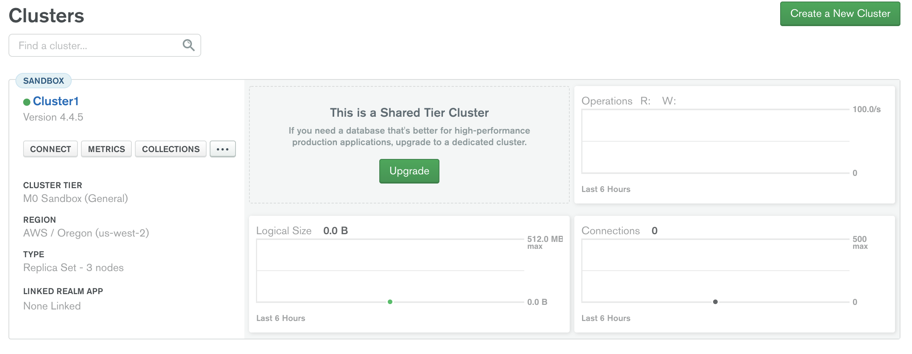
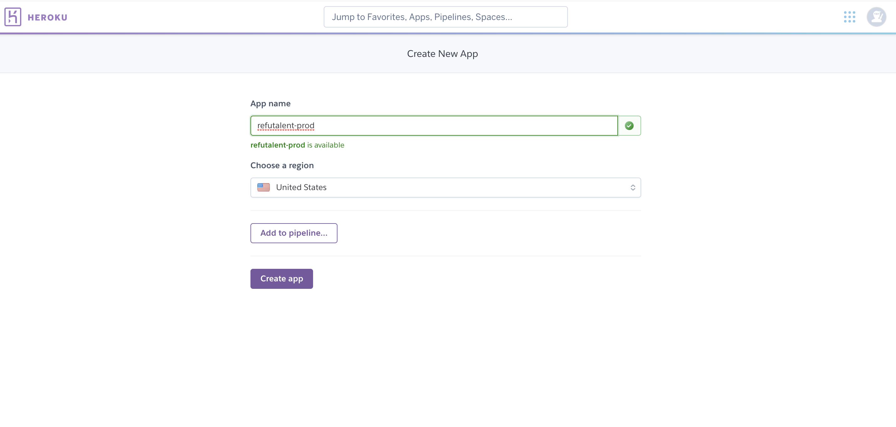
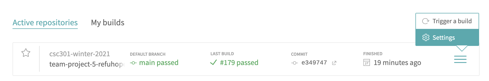
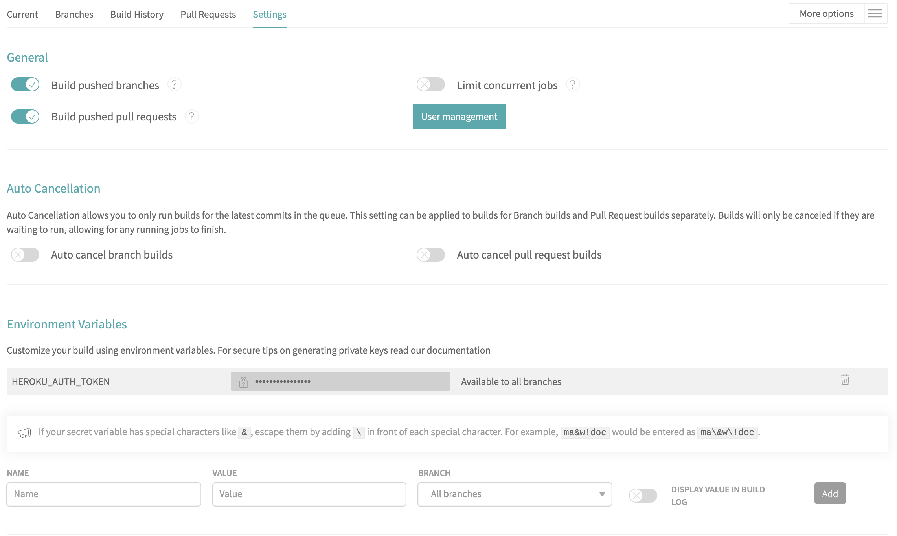

# Setting up Deployment and Hosting services

This is a tutorial of how to run this project with MongoDB Atlas and Heroku. There are also steps to set up deployment with Travis CI.

## Set up MongoDB Atlas

Here, we need to set up the database for the deployed application.

1. Create an account at https://www.mongodb.com/cloud.
2. Create a new shared cluster, which is the FREE option.
3. Choose the default options for `Cluster Tier`, and `Additional Settings`. Feel free to change `Cloud Provider and Region` and `Cluster Name`. Click `Create Cluster`. It will take a few minutes to complete.
4. Click the `Connect` button. 


5. Click `Allow Access from Anywhere` and then `Add IP Address`. Use the default values.
6. Enter a Username and Password to create a Database User. Click `Create Database User`.
7. Click `Choose a connection method`.
8. Click `Connect your application`. On this page, make sure the driver is `Node.js`. Next, copy the value below. This will be used when setting up the Heroku app.

    - Make sure to change the username and password to match the values chosen at step 6. Make sure to change the database name from `myFirstDatabase` to a chosen name. It should look something like this:

```
mongodb+srv://<DATABASE USER USERNAME>:<DATABASE USER PASSWORD>@cluster0.uanpp.mongodb.net/<DATABASE NAME>?retryWrites=true&w=majority
```


## Set up Heroku

Here, we need to set up the Heroku app to be connected with the application.

1. Navigate to https://www.heroku.com/ and create an account.
2. In the Heroku dashboard, choose to create a new app.


3. Navigate to the `Settings` tab of the app you just created. Scroll down and click `Reveal Config Vars`.
4. Add a variable with the key as `MONGODB_URI` and the value as the value you copied in step 8 from the [Set up MongoDB Atlas](#set-up-mongodb-atlas) section. 

3. Now, download the Heroku CLI to your local machine. Follow the steps [here](https://devcenter.heroku.com/articles/heroku-cli).
4. In your Terminal program, run `heroku login`.
5. Next, run `heroku authorizations:create` to generate a long-lived auth token. This will be used for deplyoment purposes. When you run this command, you should see the following:

```
Creating OAuth Authorization... done
Client:      <none>
ID:          <ID HERE>
Description: Long-lived user authorization
Scope:       global
Token:       <AUTH TOKEN HERE>
Updated at:  Thu Apr 15 2021 13:56:58 GMT-0700 (Pacific Daylight Time) (less than a minute ago)
```


## Set up Travis CI

First, we need to change the `.travis.yml` file to match with the Heroku app you created above.

1. In the `.travis.yml` file, there is a section for deployment. Currently, there are two Heroku apps that are deployed, one for each of development and production. The code snippet looks like the following:

```
- 
  stage: Deploy
  install: skip
  script: cd ./code
  deploy: 
    - 
      api_key: $HEROKU_AUTH_TOKEN
      app: refutalent-dev
      provider: heroku
      on: 
        branch: develop
    - 
      api_key: $HEROKU_AUTH_TOKEN
      app: refutalent
      provider: heroku
      on: 
        branch: main
```

2. Now, we need to make changes to this part of the file:

```
- 
  api_key: $HEROKU_AUTH_TOKEN
  app: refutalent-dev
  provider: heroku
  on: 
    branch: develop
```

3. Change the app name to match the one you chose in step 2 of the [Set up Heroku](#set-up-heroku) section.
4. Choose the branch to be the corresponding branch for the Heroku app. Currently, there are two sections in the `.travis.yml` file that look like the code snippet above. If you only have one app to be deployed to, remove one of the sections.

Now, the `Deploy` section of the file should look something like this:
```
- 
  stage: Deploy
  install: skip
  script: cd ./code
  deploy: 
    - 
      api_key: $HEROKU_AUTH_TOKEN
      app: <NAME OF YOUR HEROKU APP>
      provider: heroku
      on: 
        branch: main
```

Next, we need to connect Travis CI to the GitHub repository.

1. Navigate to https://travis-ci.com/ and choose to `Sign up with GitHub`.
2. Give Travis permission to access the RefuTalent repository.
3. Navigate to the Travis dashboard. Click on the right button for the RefuTalent repository under `Active repositories` and click on settings.


4. Toggle on `Build pushed branches` and `Build pushed pull requests`. This will make sure that each update to a branch or pull request on GitHug will trigger a Travis build.
5. In the `Environment Variables` section, add a variable with the key as `HEROKU_AUTH_TOKEN` and the value as the auth token from step 5 in the [Set up Heroku](#set-up-heroku) section. Choose to make the variable visible to all branches. Your settings page should look something like this:



6. Next, click the `More options` dropdown and click `Trigger build`.
7. Choose the default branch of the repository, which is probably `main`. Click `Trigger custom build`.

This should trigger a Travis build of the code in the GitHub repository. 

Please see the [Travis CI documentation](https://docs.travis-ci.com/user/tutorial/) for more information.
